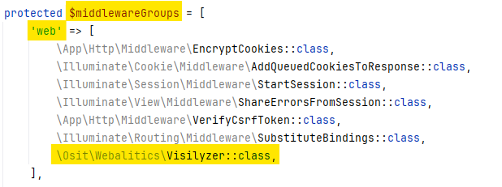
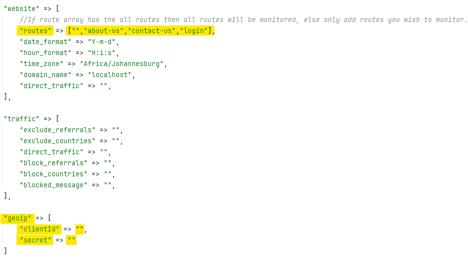

# WEBALITICS  


## About Webalitics

Webalitics is a focused web analytics software with real-time reports about the traffic sources, locations, and 
technologies used by the visitors.


## Using Webalitics

Webalitics does its magic to find out which visitor came to your website, where in the world they are, and what browser 
and OS they used. You can then draw up a plan to make your website friendlier to a demographic or include more content 
for the specific demographic.


## Getting Started

1.Composer require the package:  
````shell
$ composer require osit/webalitics:dev-master 
````
2.Initialise the package:  
````shell
$ php artisan webalitics:init
````

3.Add Webalitics as middleware to your project. From your project root:
1. locate the file '/app/Http/Kernel.php' .
2. add `\Osit\Webalitics\Visilyzer::class,` to the `'web'` index in the `$middlewareGroups` array.
   

4.Add more information to enabled Webalitics:
1. Edit the Webalitics config file that can be found at project root '/config/webalitic.php' to edit routes you would 
   like to monitor and to also add your GeoIP credentials to allow Webalitics to gather where your website visitor are 
   in the world! You can also edit your .env file to add your User Name and Website Name, although these do not affect 
   the workings for Webalitics.
   


5.Use Webalitics:
1. visit your website to check for any errors.
2. visit Webalitics Dashboard using path {/webalitics/admin} e.g.: http://127.0.0.1:8000/webalitics/admin to get your Webalitics!

## Contributing

Thank you for considering contributing to the Webalitics package!  
Please email our developer via [developer@osit.co.za](mailto:developer@osit.co.za) to find out how.

